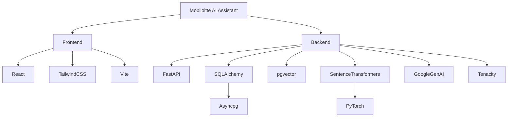
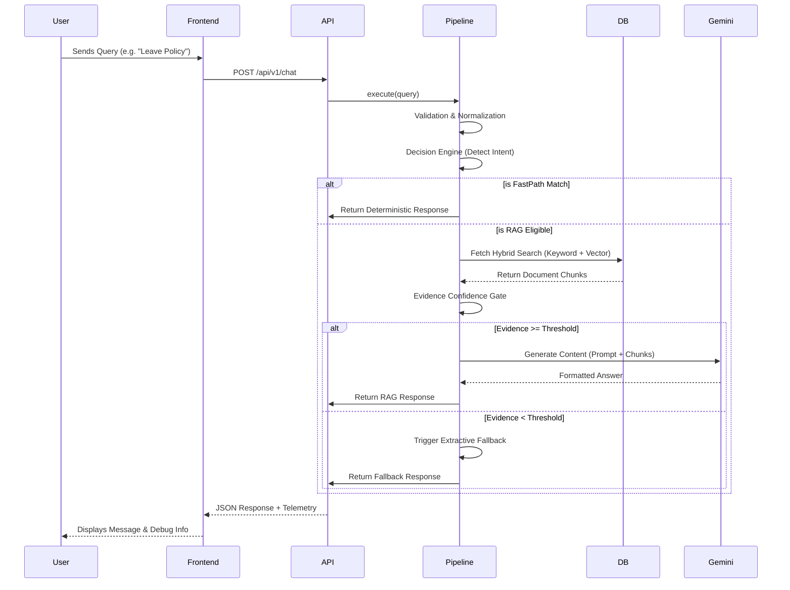

# Chapter 1 & 3: System Architecture and Technology Stack

## Purpose
The purpose of the Mobiloitte Enterprise AI Knowledge Assistant is to provide an accurate, highly scalable, and deterministic enterprise AI search engine. Instead of a standard conversational bot that hallucinates, this system operates strictly on a Retrieval-Augmented Generation (RAG) architecture with strong deterministic gating mechanisms (FastPath, Decision Engine, Evidence Gates) to ensure that the AI only responds when it has verifiable evidence from uploaded corporate documents.

This chapter details the high-level system architecture, the document and request pipelines, and the complete technology stack used to achieve these enterprise-grade requirements.

---

## 1. High-Level System Architecture

The system is decoupled into three primary tiers:

1. **Frontend Presentation Tier (React):** A modern, responsive web application serving as the conversational interface and admin portal. It maintains user sessions, displays conversation history, and provides real-time Developer Mode telemetry.
2. **Backend Services Tier (FastAPI/Python):** The core intelligence of the platform. It handles API requests, orchestrates the multi-stage pipeline, runs the Decision Engine, performs semantic search, and interfaces with the external LLM provider.
3. **Data Persistence & Vector Tier (PostgreSQL + pgvector):** An advanced hybrid database storing both structured metadata (documents, chunks, sessions) and high-dimensional semantic vectors for nearest-neighbor similarity search.

### Module Communication

Modules communicate via asynchronous REST APIs over HTTP/1.1 (and SSE for streaming when configured). 
- The **Frontend** communicates exclusively with the **Backend** via the `/api/v1/chat` and `/api/v1/documents` endpoints.
- The **Backend** communicates with the **Database** via asynchronous SQLAlchemy sessions over TCP/IP using the asyncpg driver.
- The **Backend** communicates with the **Gemini API** via gRPC/HTTP through the `google-genai` Python SDK.

---

## 2. Architecture Diagrams

### 2.1 System Architecture Diagram

```mermaid
graph TD
    User([User / Browser]) <-->|HTTP/REST| Frontend[Frontend (React + Vite)]
    Frontend <-->|HTTP/REST| Backend[Backend (FastAPI)]
    
    subgraph Backend [Backend Service]
        API[API Routers]
        Pipeline[Pipeline Orchestrator]
        Embed[Embedding Service]
        LLM[LLM Generator]
    end
    
    API --> Pipeline
    Pipeline --> Embed
    Pipeline --> LLM
    
    Embed <-->|TCP/IP| Model[Sentence Transformers (Local MiniLM)]
    LLM <-->|HTTPS| Gemini[Google Gemini API]
    
    Backend <-->|SQL/TCP| DB[(PostgreSQL + pgvector)]
    
    subgraph DB [Database Server]
        Docs[Documents Table]
        Chunks[Document Chunks Table]
        Sessions[Sessions Table]
    end
```

### 2.2 Dependency Diagram



### 2.3 Request & Response Flow Diagram



---

## 3. Technology Stack & Rationale

This section explains every core technology chosen for the platform from first principles.

### 3.1 Framework: FastAPI (Python)
- **Why this design was chosen:** Python is the undisputed lingua franca of AI, Machine Learning, and NLP. FastAPI is a modern, high-performance web framework for Python based on standard Python type hints. It supports asynchronous programming (`async/await`) out of the box, which is critical for non-blocking I/O operations like calling the database or the Gemini API.
- **Alternatives:** Flask (too slow, synchronous by default), Django (too heavy for a microservice architecture), Express.js/Node (poor integration with native Python AI libraries like PyTorch).
- **Advantages:** Extreme performance (on par with NodeJS/Go), automatic OpenAPI documentation, automatic validation via Pydantic.
- **Disadvantages:** Python's Global Interpreter Lock (GIL) can bottleneck CPU-bound tasks, requiring multi-processing (handled by Uvicorn workers).

### 3.2 Database: PostgreSQL + pgvector
- **Why this design was chosen:** We require a transactional database to store documents, session history, and chunks, but we *also* require a vector database to perform semantic similarity searches. `pgvector` allows us to combine both into a single ACID-compliant database. This eliminates the need to synchronize data between a relational DB (like MySQL) and a dedicated Vector DB (like Pinecone or Milvus).
- **Alternatives:** Pinecone, Qdrant, Milvus (Adds architectural complexity and network latency), MongoDB (Poor vector support).
- **Advantages:** Single source of truth, simplified backup/restore, allows joining relational metadata (e.g., filtering by `document_id`) during vector searches (Hybrid Search).
- **Disadvantages:** Vector search at billion-scale is slightly slower than dedicated in-memory vector databases, though easily mitigated with HNSW/IVFFlat indexing.

### 3.3 Embeddings: Sentence Transformers (all-MiniLM-L6-v2)
- **Why this design was chosen:** To perform semantic search, text must be converted into high-dimensional vectors. We use `all-MiniLM-L6-v2`, a fast and lightweight model producing 384-dimensional embeddings. It runs locally in the same memory space as the Python application.
- **Alternatives:** OpenAI `text-embedding-3-small`, Google `text-embedding-004`.
- **Advantages:** Zero external API latency, zero cost per token, extremely fast CPU execution, no data privacy concerns (documents never leave the server for embedding).
- **Disadvantages:** 384 dimensions capture slightly less semantic nuance than 1536-dimensional proprietary models.

### 3.4 LLM Generator: Google Gemini API (gemini-1.5-flash)
- **Why this design was chosen:** For the final generation step, we need a highly intelligent model capable of reading retrieved chunks and synthesizing a coherent, cited response. Gemini 1.5 Flash provides near-instant time-to-first-token and an enormous context window.
- **Alternatives:** OpenAI GPT-4o, Anthropic Claude 3.5 Sonnet, Local LLaMA 3.
- **Advantages:** Extremely low latency, excellent instruction following (for prompt formatting), highly cost-effective.
- **Disadvantages:** External dependency requiring network calls and API key management. Subject to rate limits and API outages (mitigated by our Fallback Engine).

### 3.5 Validation & Serialization: Pydantic
- **Why this design was chosen:** Pydantic enforces strict type hints at runtime. If a frontend sends an invalid payload, Pydantic immediately rejects it with a 422 Unprocessable Entity error before it ever reaches our business logic.
- **Advantages:** Prevents malformed data crashes, integrates seamlessly with FastAPI.

### 3.6 ORM: SQLAlchemy
- **Why this design was chosen:** Writing raw SQL for complex hybrid queries is prone to SQL injection and hard to maintain. SQLAlchemy provides a robust Object-Relational Mapper (ORM) that abstracts SQL while still allowing raw queries when needed (like for pgvector cosine distances).

### 3.7 Resilience: Tenacity
- **Why this design was chosen:** Network calls fail. The Gemini API might return a 429 (Rate Limit) or 503 (Service Unavailable). `Tenacity` is a Python library that wraps functions with exponential backoff and retry logic. 
- **Production Consideration:** If Gemini goes down, Tenacity retries 3 times before raising an exception, which our RAG Engine catches and gracefully degrades to the local `ExtractiveAnswerGenerator`.

### 3.8 Server: Uvicorn
- **Why this design was chosen:** Uvicorn is an ASGI (Asynchronous Server Gateway Interface) web server implementation for Python. It allows FastAPI to handle thousands of concurrent connections efficiently.

---

## 4. Possible Interview Questions

**Q: Why didn't you use a dedicated vector database like Pinecone?**
*Answer:* Using `pgvector` inside PostgreSQL allows us to keep our architecture simple and maintain a single source of truth. It allows us to perform "Hybrid Searches" where we can efficiently filter vectors by relational metadata (like `document_id`) in a single ACID-compliant SQL transaction, completely avoiding the dreaded "split-brain" synchronization issues between a relational DB and an external vector store.

**Q: Why run embeddings locally but use Gemini for generation?**
*Answer:* Embeddings must be generated for every single chunk of a document during upload, and for every user query. Doing this locally via MiniLM saves thousands of API calls, reduces latency, and guarantees data privacy. However, text *generation* requires a massive LLM (10s to 100s of billions of parameters) which cannot be run efficiently on a standard CPU server without expensive GPUs. Thus, we offload only the final text synthesis to Gemini.

**Q: How does the system handle an outage from the LLM provider?**
*Answer:* We implemented an `ExtractiveAnswerGenerator` fallback. If the Gemini API returns a 503 or times out after Tenacity's exponential backoff retries, the RAG engine catches the exception and falls back to a purely programmatic regex-based extraction mechanism that outputs the most relevant sentence from the vector search as a bullet point. The user still gets their answer, and the system never crashes.
