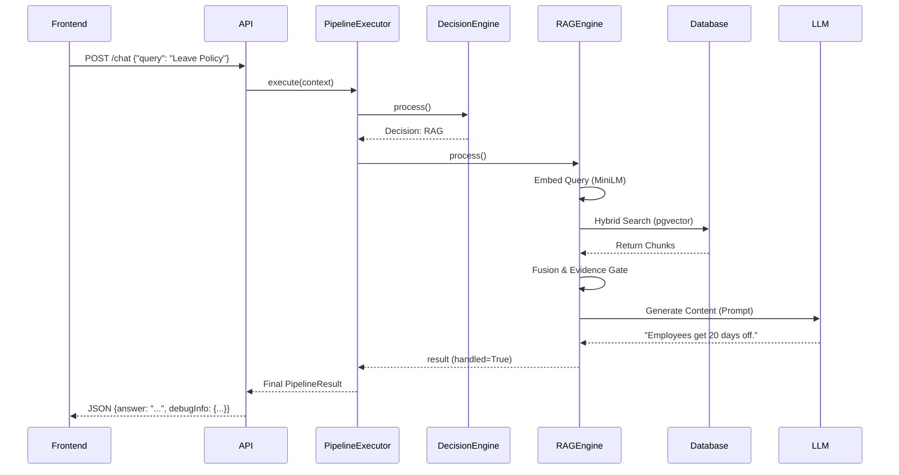

# Chapter 4: Complete Request Lifecycle

## Purpose
Understanding how a user query moves through the system from the moment the "Send" button is clicked until the answer is rendered on the screen is crucial for debugging and extending the Mobiloitte Enterprise AI Knowledge Assistant. 

Unlike standard LLM wrappers which blindly forward user text to an external API, this architecture uses a sophisticated **multi-stage pipeline**. The query is aggressively validated, normalized, and classified before it ever touches a database or an LLM.

This chapter breaks down the absolute entire lifecycle of a request, step by step.

---

## 1. Request Lifecycle Sequence

### Step 1: User Sends a Message
The user types a message (e.g., `"what is the leave policy?"`) in the React frontend and clicks send.
- The frontend packages this into a JSON payload: `{"query": "what is the leave policy?", "sessionId": "1234", "similarityThreshold": 0.4}`.
- The payload is sent via a POST request to the backend `http://localhost:8000/api/v1/chat`.

### Step 2: API Router Validation (`app.api.chat`)
The FastAPI router receives the request.
- Pydantic validates the JSON schema against the `ChatRequest` model.
- If the schema is invalid (e.g., missing query, or threshold out of bounds), FastAPI instantly returns a `422 Unprocessable Entity`.
- If valid, the router generates a unique `request_id` (UUID) and creates a `ConversationContext` object.
- The router invokes the `PipelineExecutor`.

### Step 3: Normalization & Pre-Processing
The `PipelineExecutor` passes the `ConversationContext` through the registered engines sequentially.
1. **Validation Engine:** Checks for maliciously long strings or SQL injection patterns. If it fails, it short-circuits and returns a canned error response.
2. **Normalization Engine:** Lowercases the query, strips excess whitespace, and removes special characters. `"what is the leave policy?"` becomes `"what is the leave policy"`.
3. **Empty Input Engine:** If the query was purely whitespace, it short-circuits.
4. **Alias Resolution Engine:** Checks if the query matches a known abbreviation in `configs.alias`. If the user typed "WFH", it rewrites the query internally to "Work From Home".

### Step 4: The Decision Engine
This is the "Brain" of the routing logic.
- The Decision Engine analyzes the normalized query against a strict set of regex patterns and keyword matches defined in `app/configs/`.
- It determines the **Intent**. Intents can be: `GREETING`, `SMALL_TALK`, `GOODBYE`, `THANKS`, `FAST_PATH`, `BUSINESS_RULE`, or `UNKNOWN`.
- It assigns a **Routing Decision** based on the Intent. The main decisions are `STATIC_ROUTING` (handle it locally without DB) or `RAG` (it requires document search).

### Step 5: Static Routing (Short-Circuit)
If the Decision Engine detected a static intent, it delegates to a specialized engine.
- **Greeting Engine:** If the user said "Hello", this engine sets `context.handled = True` and returns "Hello! I am the Mobiloitte Assistant...".
- **Goodbye / Thanks / Small Talk:** Similar logic.
- **FastPath Engine:** If the query hits a predefined organizational metric (like "Who is the CEO?"), FastPath instantly returns the hardcoded deterministic answer, bypassing the entire RAG pipeline to save latency and cost.
- *Crucially, if any of these engines execute, they set `handled = True`, causing the PipelineExecutor to skip all remaining engines.*

### Step 6: Knowledge Retrieval (RAG Path)
If the Decision Engine decided the query requires document knowledge (e.g., "leave policy"), the query proceeds to the **RAG Engine**.

1. **Embedding Generation:** The RAG Engine passes the query to the `EmbeddingService`. The local MiniLM model converts "what is the leave policy" into a 384-dimensional vector array.
2. **Hybrid Search:** The engine queries the PostgreSQL `chunks` table. It performs three simultaneous searches:
   - *Metadata Search:* Matches chunks where the `heading` or `filename` contains words like "leave" or "policy".
   - *Keyword Search:* Standard text matching using PostgreSQL `ILIKE`.
   - *Vector Search:* Uses `pgvector` to calculate the Cosine Distance (`<=>`) between the query vector and all chunk vectors, fetching the closest neighbors.
3. **Reciprocal Rank Fusion (RRF):** The results from the three searches are merged. A mathematical formula re-ranks them based on how highly they scored across all three methods.
4. **Evidence Confidence Gate:** The top chunks are evaluated. If the highest vector score is extremely low (e.g., below 0.30), the gate triggers an **Extractive Fallback** or a canned "I don't know" response, preventing the LLM from hallucinating.

### Step 7: LLM Generation (Gemini)
If high-confidence evidence was found:
- The chunks are formatted into a prompt context block.
- The `ConversationContext` session history is retrieved from memory.
- The massive prompt (System Instructions + History + Retrieved Chunks + User Query) is sent to the **Google Gemini API**.
- Gemini synthesizes the answer, strictly grounding itself in the provided chunks.
- The RAG Engine appends the `**Sources:**` footer to the generated text.

### Step 8: Response Serialization
The `PipelineExecutor` finishes and returns the `PipelineResult` to the API Router.
- The API Router gathers all telemetry (execution times, chunk scores, intents).
- It packages the text answer and telemetry into a `ChatResponse` Pydantic model.
- The JSON is returned to the Frontend via HTTP 200 OK.

### Step 9: Frontend Rendering
- The React app updates the state, appending the new message to the chat UI.
- The Developer Mode component parses the `debugInfo` telemetry and renders the exact execution timeline, similarity scores, and routing decisions.

---

## 2. Request Flow Sequence Diagram

---

## 3. Possible Manager Questions

**Q: Why don't you just send the user's message directly to Gemini with all the documents attached?**
*Answer:* Context windows are limited and incredibly expensive. Sending a 100-page PDF to Gemini for every message ("Hi", "Thanks", "What is the policy") would result in thousands of dollars in API costs and severe latency. Our pipeline approach ensures Gemini is only called when absolutely necessary, and only with the exact 3-4 paragraphs (chunks) needed to answer the specific question.

**Q: What happens if a user types something completely random like "xjklfds"?**
*Answer:* Our system handles this efficiently. The query passes Validation, but when it hits the Decision Engine and subsequently the RAG Engine, the Vector Search will return chunks with a very low Cosine Similarity score. Our Evidence Confidence Gate will detect that the score is below the strict threshold and immediately reject it, returning "I couldn't find enough information" without ever calling the Gemini API.

**Q: Can a user bypass the RAG system and prompt-inject the LLM to write a poem?**
*Answer:* No. The system has multiple layers of defense. First, the `is_safe_query` function in the LLM Generator scans for injection phrases ("ignore previous instructions"). Second, our system prompt strictly forces the LLM to ONLY answer based on the provided document context. If the prompt injection doesn't match document text, the Evidence Gate will likely reject it before it even reaches the LLM. If it does reach the LLM, the output validator prevents formatting breaches.
